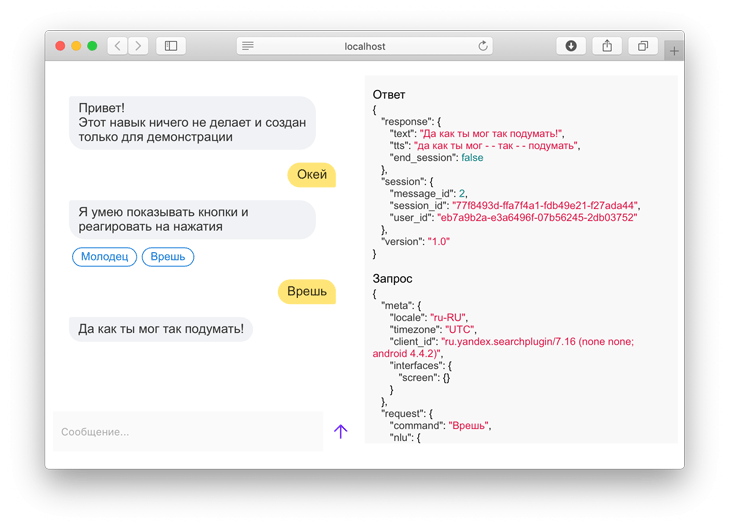

# alice-nearby

Утилита позволяет тестировать навыки [Алисы](https://alice.yandex.ru) даже без подключения к интернету. Также она облегчает тестирование навыка несколькими людьми одновременно.

## Установка

Установка и обновление происходит стандартным для _golang_ способом:

`go get -u github.com/azzzak/alice-nearby`

После скачивания репозитория утилита будет скомпилирована и помещена в папку `GOPATH/bin`. Кроме того, в папке `bin` репозитория лежат уже скомпилированные исполняемые файлы для macOS и Windows. Их можно запускать без установки _golang_.

## Использование

При запуске нужно указать адрес вебхука, принимающего команды. Опционально можно изменить порт веб-интерфейса, по умолчанию это 2345.

`./alice-nearby --webhook=http://localhost:3000/skill --port=3456`

Теперь по адресу `localhost:2345` (либо другой выбранный порт) доступен веб-интерфейс, имитирующий тестовый стенд в [личном кабинете](https://dialogs.yandex.ru/developer/).

При желании можно организовать командное тестирование навыка или привлечь дополнительных тестировщиков. Для этого надо прокинуть туннель до локального порта с веб-интерфейсом при помощи `ngrok` или аналогичного сервиса.

## Ограничения

- Не будет работать извлечение [именованных сущностей](https://tech.yandex.ru/dialogs/alice/doc/nlu-docpage/)
- Картинки не отображаются
- Кнопки работают только простые, имитирующие ввод текста
